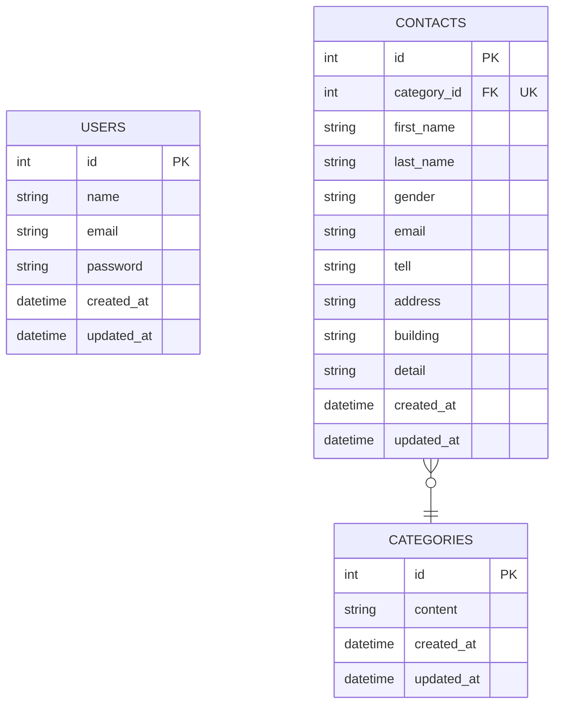

# お問い合わせフォーム

## 環境構築

### Dockerビルド
1.https://github.com/hiroyuki92/test_contact-form.git  
2.docker-compose up -d build

※MySQLは、OSによって起動しない場合があるのでそれぞれのPCに合わせてdocker-compose.ymlファイルを編集してください。

### Laravel環境構築
1.docker-compose exec php bash  
2.composer install  
3. .env.exampleファイルから.envを作成し、環境変数を変更  
4.php artisan key:generate  
5.php artisan maigrate  
6.php artisan db:seed  

### 使用技術
.PHP8.0  
.Laravel10.0  
.MySQL8.0  

### ER図

### URL
.環境開発：http://localhost/  
.phpMyAdmin：http://localhost:8080/
